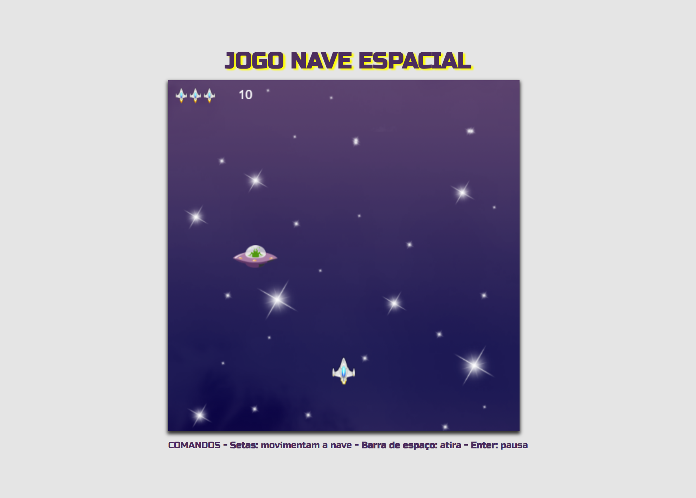

# Jogo Nave Espacial
Este projeto foi desenvolvido como um exercício baseado no livro "Desenvolva Jogos com HTML5 Canvas e Javascript", da Casa do Código. 

O objetivo do <b>Jogo Nave Espacial</b> é eliminar o maior número possível de OVNIs. O jogador possui 3 vidas extras e deve utilizar os 
seguintes comandos no teclado: as <b>setas</b> para movimentar a nave, a <b>barra de espaço</b> para atirar e a tecla <b>Enter</b> para pausar o jogo.

No livro, são abordados os seguintes conceitos:
 - Fundamentos da Canvas API
 - Animações de elementos e efeito parallax
 - Interação com o jogador através teclado
 - Utilização de folhas de sprites
 - Detecção de colisões
 - Adição de sons, pausas e vidas extras ao jogo
   
## 💻 Layout   

  

## 🔧 Tecnologias
As tecnologias usadas foram:
- HTML
- Canvas API
- CSS
- JavaScript

## 🛠️ Como Executar o Projeto

Para jogar, basta [clicar aqui](https://jogo-nave-khaki.vercel.app/) e desfrutar da experiência!
Divirta-se!
